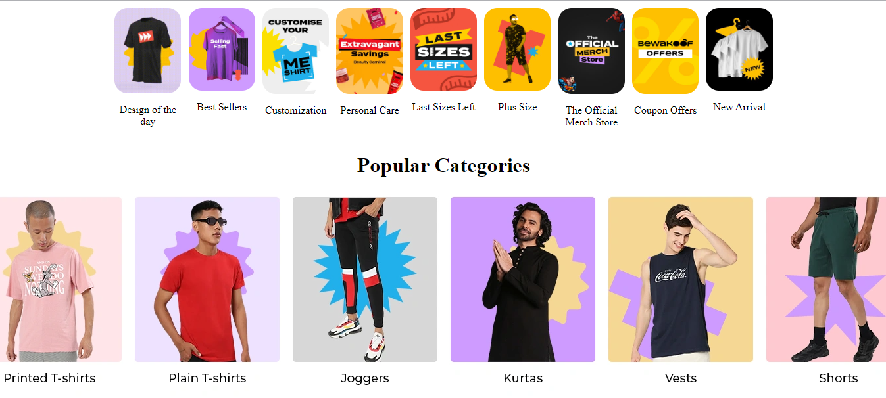
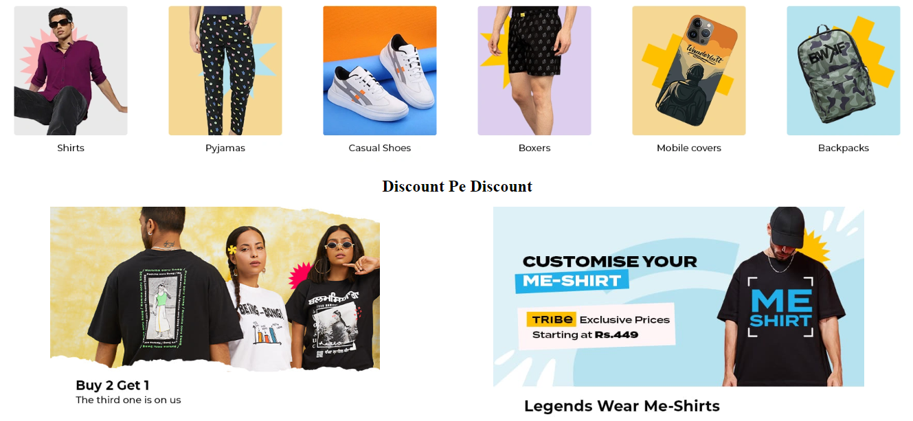

# E-commerce Website  <a href="https://resilient-bavarois-80f56f.netlify.app/">Live View</a>

This is a landing page of E-commerce website called <a href="https://resilient-bavarois-80f56f.netlify.app/">Bewakoof.com</a>

**_You can visit [here](https://resilient-bavarois-80f56f.netlify.app/)._**

## Tech Stack

- HTML
- CSS

Here are screenshots that show the how Landing page look like.

 
<h2 align="center">Landing Page</h2>

The Home Page displays a complete overview of the website and the featured brands.

 

 

